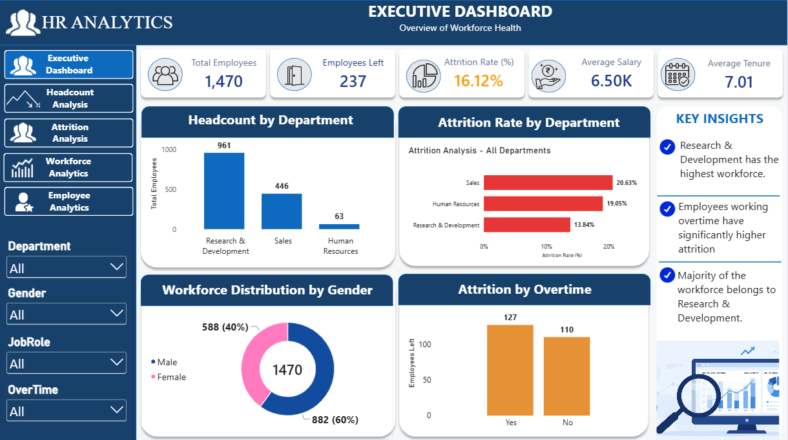
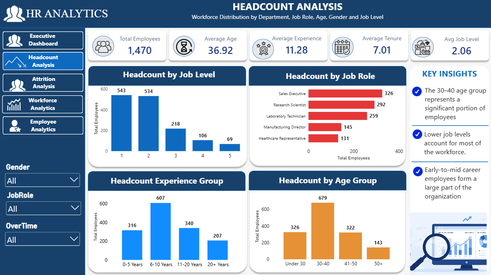
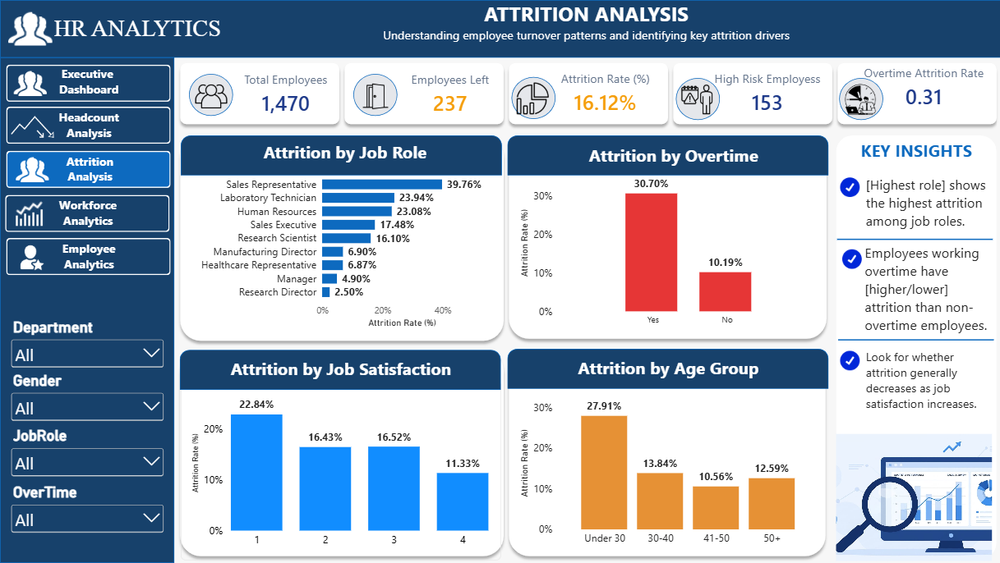
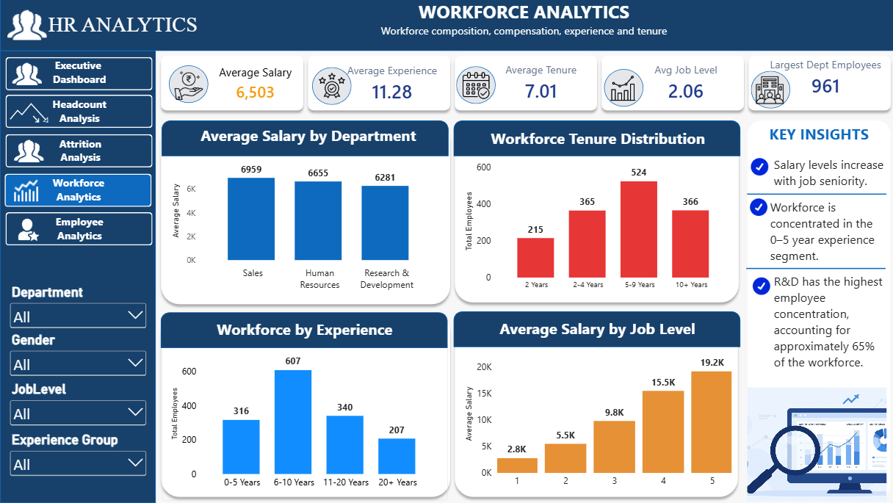
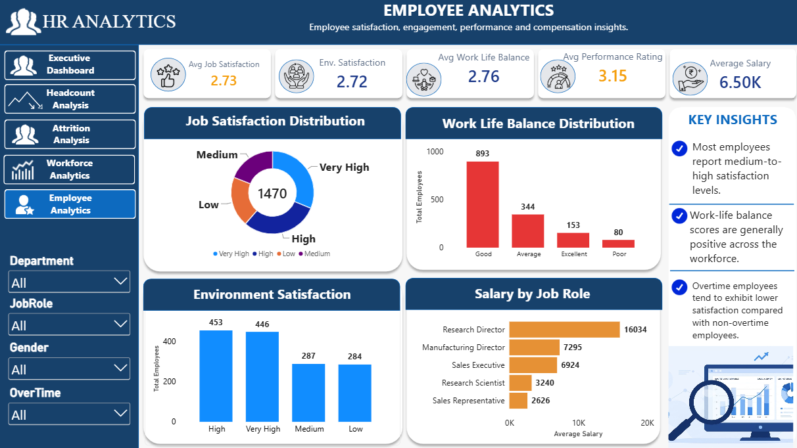

# 📊 HR Analytics: Employee Attrition, Headcount & Workforce Insights

## 🚀 Project Overview

This project analyzes employee workforce data to uncover attrition trends, workforce demographics, employee satisfaction patterns, and retention risks.

The objective is to help HR teams and business leaders make data-driven decisions using interactive dashboards and actionable insights.

## 🎯 Business Problem

The organization has 1,470 employees and wants to answer critical workforce questions such as:

✅ Why are employees leaving?

✅ Which departments experience the highest attrition?

✅ Does overtime impact employee retention?

✅ How satisfied are employees with their jobs?

✅ Which employee groups are at higher retention risk?

✅ How is the workforce distributed across departments, age groups, and job levels?

## 🛠️ Tools & Technologies

Tool	Purpose
- 📊 Microsoft Excel:-	Data Cleaning, Feature Engineering, Analysis
- 🗄️ MySQL:-	Data Validation & Business Queries
- 📈 Power BI:- 	Data Modeling, DAX, Visualization
- 💻 GitHub:- 	Documentation & Portfolio Showcase
- 📂 Dataset Information

Dataset Source: IBM HR Analytics Employee Attrition Dataset (Kaggle)

## 📌 Dataset Summary

- 👥 Total Employees: 1,470
- ✅ Active Employees: 1,233
- 🚪 Employees Left: 237
- 🏢 Departments: HR, Sales, Research & Development

## Key Attributes
- 👤 Age
-🚪 Attrition
- 🏢 Department
- 💼 Job Role
- 👨‍💼 Gender
- 💰 Monthly Income
- ⏰ Overtime
- 😊 Job Satisfaction
- ⚖️ Work-Life Balance
- 📅 Total Working Years
- 🏆 Performance Rating
- 📈 Years at Company

❓ Key Business Questions

### 👥 Headcount Analysis
- Total workforce size
- Department-wise employee distribution
- Job role headcount
- Gender diversity analysis
- Age group distribution
- Job level distribution

### 🚪 Attrition Analysis
- Overall attrition rate
- Department attrition comparison
- Job role attrition trends
- Overtime vs attrition
- Satisfaction vs attrition
- Age-group attrition analysis

### 🏢 Workforce Analysis
- Average employee experience
- Salary by department
- Salary by job level
- Workforce distribution
- Employee tenure analysis

### 😊 Employee Insights
- Performance rating analysis
- Job satisfaction trends
- Work-life balance evaluation
- Salary comparison across roles
- Retention risk identification

📋 Project Workflow
```
Raw Dataset
      ↓
Excel Data Cleaning
      ↓
Feature Engineering
      ↓
SQL Data Validation
      ↓
Power Query Transformation
      ↓
Data Modeling
      ↓
DAX Calculations
      ↓
Interactive Dashboards
      ↓
Business Insights
```

## 📊 Dashboard Pages

### 🏆 Executive Dashboard

Provides a high-level overview of workforce KPIs, attrition metrics, and employee statistics.

### 👥 Headcount Analysis

Analyzes workforce distribution by department, gender, age group, and job level.

### 🚪 Attrition Analysis

Identifies attrition trends across departments, job roles, overtime categories, and demographics.

### 🏢 Workforce Analysis

Examines salary, experience, tenure, and workforce composition.

### 😊 Employee Analytics

Provides insights into employee satisfaction, performance ratings, and work-life balance.

## 📸 Dashboard Screenshots

###  Executive Dashboard



### Headcount Analysis



### Attrition Analysis



### Workforce Analysis



### Employee Analytics



## 💡 Key Insights
- Attrition rate identified across all departments.
- Overtime employees show higher attrition risk.
- Certain job roles contribute significantly to employee turnover.
- Employee satisfaction impacts retention.
- Salary and job level influence workforce distribution.

## ⭐ Skills Demonstrated
- Data Analytics
- Data Cleaning
- Exploratory Data Analysis (EDA)
- Business Analysis
- KPI Development
- SQL
- Aggregations
- Joins
- Group By
- Business Query Development
- Power BI
- Power Query
- Data Modeling
- DAX Measures
- Interactive Dashboard Design
- Business Intelligence
- HR Analytics
- Attrition Analysis
- Workforce Planning
- Executive Reporting

📁 Repository Structure
```
HR-Analytics-Employee-Attrition-Dashboard
│
├── Dataset
├── Excel
├── SQL
├── PowerBI
├── Images
└── README.md
```

👩‍💻 Author

Nisha Borse

🎓 MCA Graduate (2025)

📊 Aspiring Data Analyst | Power BI Developer

🔗 GitHub: https://github.com/100-Nisha

🌟 If you found this project useful, don't forget to give it a star!
